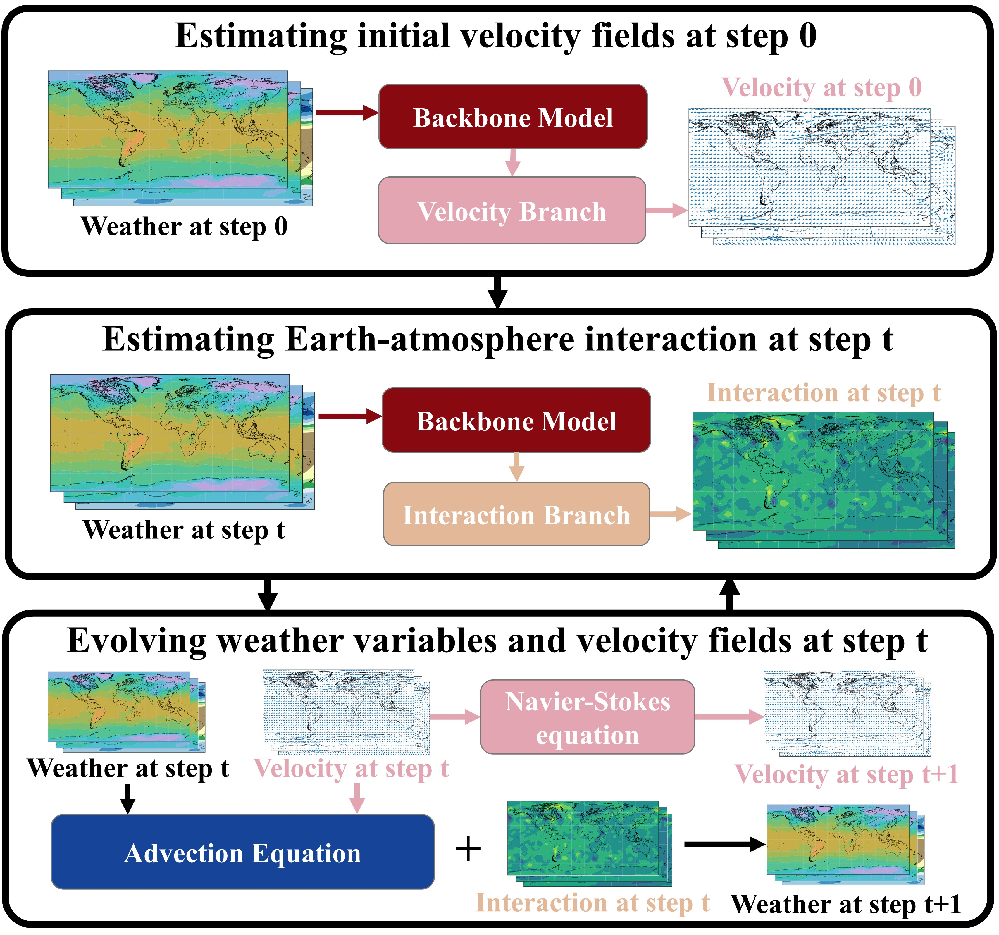
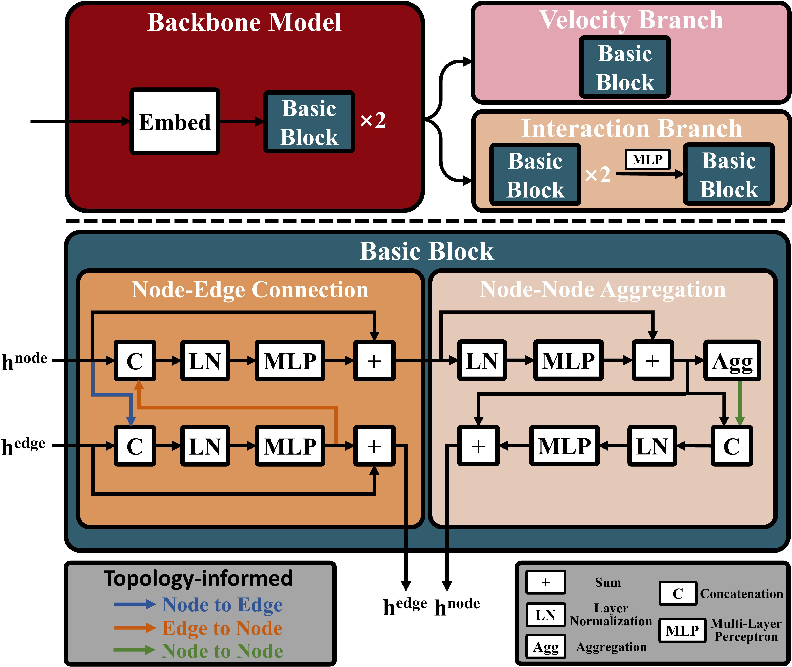

# PASSAT
This repo is the official implementation of "Physics-Assisted and Topology-Informed Deep Learning for Weather Prediction".

## Updates
> ***04/28/2025*** 

* PASSAT has been accepted for IJCAI 2025. :tada: :tada: :tada: 

## Introduction
PASSAT is a novel deep learning model for weather prediction. PASSAT attributes the weather evolution to two key factors: (i) the advection process that can be characterized by the advection equation and the
Navier-Stokes equation; (ii) the Earth-atmosphere interaction that is difficult to both model and calculate. PASSAT also takes the topology of the Earth’s surface into consideration, other than simply treating it as a plane. With these considerations, PASSAT numerically solves the advection equation and the Navier-Stokes equation on the spherical manifold, utilizes a spherical graph neural network to capture the Earth-atmosphere interaction, and generates the initial velocity fields that are critical to solving the advection equation from the same spherical graph neural network.

<div align="center">
 
</div>

## Main Results on 5.625° ERA5
For fair comparisons, we **unify the number of parameters, the input variables, as well as the training strategy** of all models and **train these baseline deep learning models from scratch** according to their open-source codes and [NVIDIA’s Modulus](https://github.com/NVIDIA/physicsnemo/tree/main).

The following table describes the comparisons between PASSAT and the other models in terms of RMSEs, over the test set. For each lead time and each weather variable, the best model RMSE is in **bold** and the second best model RMSE is in *italic*.
  
|  | **Lead Time (h)** | **PASSAT** | **GraphCast** | **ClimODE** | **Pangu** | **FourCastNet** | **SFNO** | **IFS T42** | **IFS T63** | 
| :---: | :---: | :---: | :---: | :---: | :---: | :---: | :---: | :---: | :---: | 
| **Physics-assisted** | - | :heavy_check_mark: | :x: | :heavy_check_mark: | :x: | :x: | :x: | - | - |
| **Topology-informed** | - | :heavy_check_mark: | :heavy_check_mark: | :x: | :x: | :x: | :x: | - | - |
| **Parameters** (M) | - | 1.15 | 1.15 | 1.33 | 1.20 | 1.17 | 1.15 | - | - |
|  |  |  |  | |  |  | |  |  | 
| | 24 | *1.25* | **1.21** | 1.59 | 1.31 | 1.29 | 1.43 | - | - |
| | 48 | *1.54* | **1.52** | 2.23 | 1.63 | 1.58 | 1.75 | - | - |
| **t2m** | 72 | *1.85* | **1.84** | NAN | 1.94 | 1.87 | 2.02 | 3.21 | 2.04 |
| | 96 | **2.16** | *2.17* | NAN | 2.26 | **2.16** | 2.30 | - | - |
| | 120 | **2.44** | *2.48* | NAN | 2.55 | **2.44** | 2.55 | 3.69 | **2.44** |
| | 144 | *2.69* | 2.75 | NAN | 2.80 | **2.68** | 2.76 | - | - |
|  |  |  |  | |  |  | |  |  | 
| | 24 | **1.29** | **1.29** | 1.46 | 1.40 | *1.39* | 1.51 | - | - | 
| | 48 | **1.66** | *1.69* | 2.26 | 1.83 | 1.78 | 1.91 | - | - |
| **t850** | 72 | *2.12* | 2.17 | NAN | 2.31 | 2.24 | 2.37 | 3.09 | **1.85** |
| | 96 | **2.59** | *2.67* | NAN | 2.79 | 2.71 | 2.84 | - | - |
| | 120 | *3.03* | 3.12 | NAN | 3.21 | 3.12 | 3.25 | 3.83 | **2.52** |
| | 144 | **3.39** | 3.49 | NAN | 3.55 | *3.47* | 3.59 | - | - |
|  |  |  |  | |  |  | |  |  | 
| | 24 | **171** | *180* | 209 | 196 | 188 | 205 | - | - |
| | 48 | **293** | *307* | 452 | 337 | 313 | 342 | - | - |
| **z500** | 72 | *420* | 438 | NAN | 477 | 442 | 478 | 489 | **268** |
| | 96 | **543** | *565* | NAN | 605 | 566 | 607 | - | - |
| | 120 | *651* | 675 | NAN | 712 | 674 | 718 | 743 | **463** |
| | 144 | **738** | 767 | NAN | 797 | *760* | 807 | - | - |
|  |  |  |  | |  |  | |  |  | 
| | 24 | **1.54** | *1.59* | 1.77 | 1.68 | 1.68 | 1.83 | - | - |
| | 48 | **2.22** | *2.29* | 2.73 | 2.41 | 2.38 | 2.50 | - | - |
| **u10** | 72 | **2.90** | *2.97* | NAN | 3.08 | 3.05 | 3.18 | - | - |
| | 96 | **3.46** | *3.54* | NAN | 3.61 | 3.60 | 3.73 | - | - |
| | 120 | **3.89** | *3.97* | NAN | 4.01 | 4.00 | 4.13 | - | - |
| | 144 | **4.19** | *4.27* | NAN | 4.29 | 4.29 | 4.41 | - | - |
|  |  |  |  | |  |  | |  |  | 
| | 24 | **1.57** | *1.62* | 1.80 | 1.71 | 1.72 | 1.86 | - | - |
| | 48 | **2.26** | *2.32* | 2.73 | 2.44 | 2.42 | 2.53 | - | - |
| **v10** | 72 | **2.95** | *3.03* | NAN | 3.14 | 3.12 | 3.24 | - | - |
| | 96 | **3.55** | *3.64* | NAN | 3.70 | 3.70 | 3.83 | - | - |
| | 120 | **4.01** | *4.10* | NAN | 4.13 | 4.14 | 4.27 | - | - |
| | 144 | **4.34** | 4.44 | NAN | *4.43* | 4.44 | 4.57 | - | - |

## Main Results on 1.4° ERA5
Coming soon ...

## Citing PASSAT
```
@misc{zheng2025physicsassistedtopologyinformeddeeplearning,
      title={Physics-Assisted and Topology-Informed Deep Learning for Weather Prediction}, 
      author={Jiaqi Zheng and Qing Ling and Yerong Feng},
      year={2025},
      eprint={2505.04918},
      archivePrefix={arXiv}
}
```

## Getting Started

Please see [get_started.md](get_started.md) for detailed instructions.
